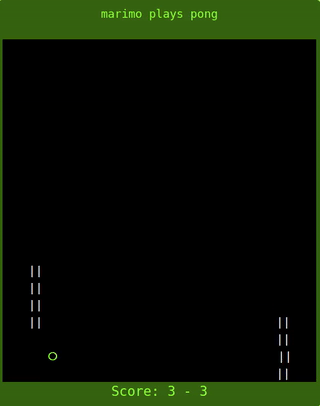

# marimo plays Pong

A simple "self-playing" Pong game implementation using [Marimo](https://marimo.io) - a reactive notebook for Python. Inspired by the retro graphic design of Pong.  The goal was to experiment with `marimo.Html` and `marimo.output.replace`.

## App author/layout/design
* [@vrtnis](https://github.com/vrtnis/)
* Inspired by Pong

## Versioning
* Based on marimo 0.2.5 

## Requirements
marimo (pip install marimo)

Leverages Marimo's `Html` class and `output.replace` method to dynamically render the game's visuals and manage UI updates. So by utilizing Python's standard utility modules alongside Marimo's built-in functionality, we can avoid the need for external third-party modules.

### Dynamic Rendering with `marimo.Html`

Uses `marimo.Html` to construct the visual representation of the Pong game board, including paddles and the ball. The code dynamically generates the game board's HTML content for the rendering of game elements at variable positions to simulate motion. 

### Real-time UI Updates with `marimo.output.replace`

To animate `marimo.output.replace` is used in a loop to update the game board's state, effectively re-rendering the "ball" at new locations and moving the paddles. This method is invoked within the `animate_game` function, which iteratively calls `update_game` to adjust the game state.  

## Features

- **Game Board**: A 40x20 grid where the game takes place.
- **User and Computer Paddles**: Both paddles move autonomously to hit the ball back and forth.
- **Scoring System**: Points are scored when the opponent fails to return the ball.
- **Simple "AI"**: The "computer" paddle moves automatically to hit the ball, with a small chance to miss.

The game is generally implemented as follows:

- **Game Board Dimensions**: The canvas is set to a width of 40 and a height of 20.
- **Paddle and Ball Representation**: Paddles for the user and computer are defined along with their properties (position, size, score). The ball is also defined with its position and velocity.
- **Game Mechanics**: Functions are included to handle game updates, such as ball movement, collision detection, and score updates.
- **Rendering**: The game board, paddles, and ball are rendered as HTML using `marimo.Html`.

## Running the Game

To run the game, ensure you have Marimo installed and configured in your environment. The game starts by executing the Python script, which initializes the Marimo app and begins the game animation.

